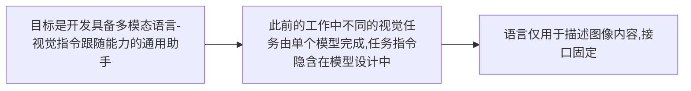
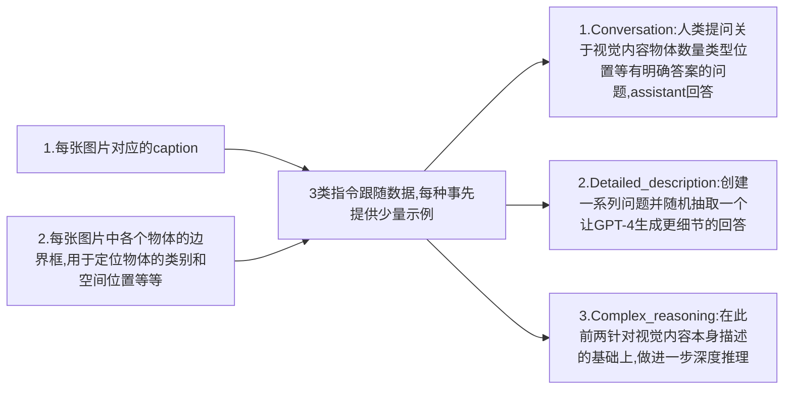

# Visual Instruction Tuning

## Abstract

1. **什么是"Instruction Tuning"**
    - 简而言之就是训练模型理解和执行不同的指令，提升模型遵循人类指令的能力，达到zero-shot/few-shot的效果
    - 核心思想是“以指令为中心”
    - 第一步是进行指令数据集构建，构建方式有很多，本文相关的方式是利用LLM生成指令-响应对。数据集要求多样化，高质量
    - 第二步是进行指令微调训练(Instrucion Tuning Training),训练的目标是**最大化模型在给定指令下生成期望响应的概率**

2. **本文的主要贡献**
   - Instrucion Tuning的方法在LLM领域已经得到应用，但在 **multimodal(多模态)** 领域研究较少
   - 首次尝试使用纯语言模型GPT-4生成多模态指令跟随数据
   - 在上述数据上应用Instruction Tuning,推出**LLaVA(Large Language and Visual Assistant)**
   - 构建了两个evaluation benchmarks
  
3. **实验结果**
   - 在合成多模态指令跟随数据集上，其相对 GPT-4 的得分达 85.1%
   - 在Science QA数据集上微调时，LLaVA 与 GPT-4 的协同作用实现了 92.53% 的新 SOTA(state-of-the-art) 准确率

## Introduction

此前的工作：



实际上语言可以承担更重要的角色：作为通用接口，引导模型切换到特定任务并完成目标。

**本文的具体贡献**：

1. **Multimodal instruciton-following data**：
   - 提出了一种数据重构的想法和pipline，把现有数据集的图像-文本对利用GPT-4改变成指令跟随的格式。
        >譬如说：原本的文本描述图片中有一些苹果放在桌子上，经过转换后即可变为“指令-响应”的格式：“桌子上有几个苹果？”“有3个”
2. **Large Multimodal model**:
   - 推出了一个LMM,由CLIP的视觉编码器和Vicuna的文本解码器连接构成。
        > CLIP的视觉编码器最大的优势在于“开放集识别能力”——即能理解训练中未见过的视觉概念，并不局限于固定类别
        > Vicuna是基于LLaMA微调的对话模型，在指令跟随能力上表现突出（接近 ChatGPT 水平）
   - 完成模型搭建后，在生成的指令-响应对数据集上进行端到端微调

3. **Multimodal instruction-following benchmark**
   - 提出两个具有挑战性的benchmarks

4. **open-source**
   - 开源data,code,checkpoints,demo

## Related Work

1. **Multimodal instruction-following Agents**

    现有的工作基本上可以归结为两类：
   - End to end trained models:针对特定研究主题单独探索。
   - 协调多个模型的系统，诸如Visual ChatGPT等等

2. **Instruction Tuning**

   NLP领域在这方面已经做过一些工作，这种方法能有效提升 LLM 的零样本和少样本泛化能力。
   自然而然的，也就想到向视觉领域迁移。
   在本文之前的各项工作(包括"best"的LLaMA)都没有明确提出视觉-语言的指令微调，在多模态任务中的性能通常落后于纯语言任务，本文正是填补了这部分空白。

## GPT-assisted Visual Instruction Data Generation

1. **当前数据集面临的问题**

- 当前有很多视觉-语言数据集，但可用的multimodal instruction following data却很少,原因是人工标注耗费大量时间且定义不明确(less well-defined)
- 从GPT在文本标注领域取得的成功受到启发，**借助(leverage)GPT，基于现有的image-text对**数据集生成多模态指令跟随数据。

2. **具体的数据集生方法**

首先提到，现存的image-text数据集基本都是一张图像会对应一个caption，因此比较自然的想法是生成一系列问题，引导模型描述图像的内容。即人类给出question和视觉内容，图像给出caption回答。这种方式有多样性和深度不足的缺点。

本文提出了如下方法：使用纯语言GPT-4/chatGPT，只接受文字内容生成指令跟随数据。该方法的重点在于**将视觉内容编码为纯文本GPT可识别的形式**：



最终，本文收集了158k语言-图像指令跟随样本，内含58k对话，23k详细描述，77k复杂推理。且验证了GPT-4生成的数据质量更高。

## Visual Instruction Tuning

### Architecture 架构
想法是有效利用已有的预训练模型。LLM方面选用了开源模型中指令跟随能力最强的Vicuna（可找到checkpoints），视觉提取方面选用了CLIP中的visual encoder ViT-L/14.


 
根据上面图片提供的架构，首先是向Vision Encoder输入图片$X_v$,假设处理的过程是$Z_v = g(X_v)$,这里的$Z_v$实际上也就是图像的特征信息。
文中提到grid features,应该是保留图像各个网格状分区域的特征信息。
除此以外还提到“before and after last transformer layer”,last transformer layer之前的特征信息更关注局部细节，而last transformer layer之后的信息更关注全局语义。

得到$Z_v$之后，需要做的事情是把特征转化成LLM模型可接收的维度，本文采用的是比较简单的**线性投影**方法：首先定义一个可训练的矩阵$W$,经过矩阵乘法：
$${H_v} = W \cdot {Z_v},with Z_v = g(X_v)$$
文中称$H_v$为language embedding tokens/visual tokens,也就是可被语言模型处理的承载视觉信息的信号。

文中也提到，本文多模态对齐方法是比较简单的，这种方式的好处是便于在不同的数据集上实验。也有一些别的跨模态连接方法，例如FLamingo的门控交叉注意力和BLIP-2的Q-former。

### Trainig 训练

训练的方法是需要重点关注的部分。本文从训练数据组织方式、训练目标、训练步骤与各项细节展开介绍

1. **数据组织方式**
   此前我们已经知道数据的生成方式，那么数据在传递给模型用于训练时应该以何种格式进行？   
   首先，对于每一张图片$X_v$,我们都有一系列问答：$\left( {X_q^1,X_a^1, \cdots ,X_q^T,X_a^T} \right)$,我们向模型输入的序列**遵循“指令+回答($X_{instruct}^t+X_a^t$)”的格式**,唯一需要稍加注意的是首轮输入指令时还需要输入图像信息，具体如下：


 $$X_{instruct }^{t}=\left\{\begin{array}{lr} Randomly choose \left[X_{q}^{1}, X_{v}\right] or \left[X_{v}, X_{q}^{1}\right], & the first turn t=1 \\ X_{q}^{t}, & the remaining turns t>1 \end{array} \quad\right.$$

2.**训练目标**
   沿用了语言模型中原有的“**自回归预测**”
   > 简单解释一下自回归预测：该思想的核心逻辑是**基于已生成的内容，逐步预测下一个元素**，举例来说，在生成一个句子（序列）时，每预测下一个词语（元素）都需要依赖回顾前面各项元素的信息。“自”就是依赖自身，“回归”就是指基于历史预测下一个
   
   言归正传，说一下这里的自回归具体逻辑：模型根据输入的图像信息和指令问题，依次预测回答中每个令牌（词语/字词），直到生成完整的回答。训练时将**预测令牌和真实回答之间的匹配度**作为优化目标。假设某序列长$L$,那么给定图像$X_v$和指令$X_{instruction}$时，模型生成正确回答$X_a$的概率为：

$$
p\left(X_{a} | X_{v}, X_{instruct }\right)=\prod_{i=1}^{L} p_{\theta}\left(x_{i} | X_{v}, X_{instruct ,<i}, X_{a,<i}\right)$$
这里重点解释一下上面这个式子：
- 首先，$\theta$代指整个模型中的可训练参数
- 第二，$X_{instruct ,<i}$和$X_{a ,<i}$是第i个令牌之前所有的指令和回答
- 公式的核心逻辑在于基于全部的历史预测下一个，公式里明确依赖项包括了**图像信息**（确保模型不会瞎编），**当前令牌前的指令和回答**（确保模型记住上下文）。除此以外还有被省略的系统提示信息和停止符。

显然，我们的训练目标也就是要最大化这个概率

3.**训练方法**
分成两个阶段训练
- **第一阶段:Pre-training for Feature Alignment**：这一阶段冻结CLIP的vision_encoder和Vicuna语言模型的参数，仅调整投影矩阵$W$.这里的意义是**对齐**。
  
  > 这里首先引入一下**嵌入空间**和**嵌入距离**的概念，在NLP和multimodal等领域，常常将每个数据(譬如一个词/一张图)转换成一个高维的向量，这个向量就被称为**嵌入向量**，其意义是让机器能够通过向量运算衡量语义关联。那么怎样才算关联强呢？这就需要通过**嵌入距离**判断，嵌入向量之间的距离越小就说明语义越接近。

  这样我们就很容易知道$W$的作用了：LLaVA中视觉模型和语言模型是分别单独训练的，对于某一具体事物，前者编码后的嵌入向量未必与后者同一事物对应的嵌入向量嵌入距离较近，这就是**不对齐**的。因此我们的目标就是要通过调整$W$，让对A事物对应的视觉令牌$H_v$与语言模型中描述A事物的词向量尽可能的接近，而与描述B事物或是别的什么各类事物的词向量尽可能远离。这也就是做到了**对齐**。

  OK那么这一阶段的目标很明确了，接下来就是如何对数据进行处理：本文从CC3M（Conceptual Captions 3M）数据集的300万对数据中筛选了595k对，既保证了训练的效率有保证了足够多的样本。转化成“指令-回答”的方式已经在前面说过了

  那么什么样的$W$才算是好的？评判依据当然是使之前提到的生成正确回答的概率比较大的。

- **第二阶段：Fine-tuning End-to-End**：这个阶段还是继续保持视觉模型参数冻结，可训练的参数扩展为投影矩阵$W$和Vicuna的权重参数$\phi$,且满足“端到端”，两参数被联合优化。文中提到考虑了两种场景，分别如下：
  - **Multimodal Chatbot**:使用此前生成的158k数据进行微调，此前提到的三种类型中，对话类型采用多轮训练，详细描述和深度推理都只采用单轮
  - **Science QA**:Science QA 是一个大型多模态科学推理数据集，包含 21K 道科学问题（涉及自然科学、社会科学等），每个问题配有文本或图像上下文（如 “解释光合作用的图”“物理公式推导的文字说明”），且答案附带详细的讲解和推理过程。
   将该数据集中的问题和上下文作为$X_{instruction}$,推理答案+最终答案作为$X_a$

   上述两种场景其实分别代表了模型的**通用交互能力和复杂推理能力**

## Experiments

本章重点说明实验设计方法和结论，首先搞清楚实验想要说明的LLaVA两个方面的性能：
1. **多模态指令跟随能力**
2. **复杂视觉推理能力**

训练配置：8*A100,遵循Vicuna超参数，预训练阶段(特征对齐)在过滤后的CC-595K数据集上训练1个epoch（lr=2e-3,batch_size=128）,微调阶段在158K指令数据集上训练3个epoch(lr=2e-5,batch_size=32)
针对这两大能力分别设计了下面两个实验:
1. **Multimodal Chatbot**
2. **Science QA**

首先来看看文章是如何设计实验说明LLaVA的图像理解和对话交互能力的，这里是给出了一个从定性到定量的过程。

- **定性**感知方面是选取了GPT-4论文中“极端熨烫”（一个人在车顶上熨衣服）的图像案例，对比 LLaVA、GPT-4、BLIP-2、OpenFlamingo 的响应。结果表明了LLaVA和GPT-4一样可以理解指令的意图，而其他模型just描述图像内容， **这说明了visual instruction tuning对模型指令跟随能力的提升**。

当然只有定性的判断是很不严谨的，还需要设计**quantitative evaluation**(定量评估)。传统的对多模态模型的评估大多依赖人工打分/特定任务准确率，这无法衡量模型的“指令跟随能力”。so,本文旨在给出一种**标准化的**(指能横向比较不同模型的)、**不依赖某单一任务的**、**可以衡量模型指令跟随能力的**评估方法

- 本文采用的思路是把GPT-4作为一个满分基准，类似于裁判的角色，让然后比较其他几种模型生成结果相对于这个裁判的得分。
  1. 第一步是为每个评估样本创建一个**三元组**：(image图像,ground_truth textual descriptions对图像内容的真实文本描述,question问题)
  2. 第二步是各自模型生成响应:

      ```mermaid
         flowchart LR
            image+question --> 候选模型 --> 待评估响应
            A[ground_truth textual descriptions+question]
            B[纯文本GPT]
            C[参考响应（由于是对图像准确描述的文本生成的，所以可以被视作理论上限）]
            A --> B --> C
      ```
  3. 得分包含“**有用性、相关性、准确性、细节丰富度**” 四个维度，每个维度1-10分。

OK思路有了，这时候文章说"We create two benchmarks to evaluate the model’s performance",这两个benchmarks也是本文的突出贡献

1. **LLaVA-Bench(COCO)**
   - 众所周知COCO是一个常用的标准数据集，所以这个benchmark主要用来评估模型的视觉对齐能力以及处理常规视觉输入时的稳定性。
   - 文中在COCO-Val-2014中随意选取了30张图片，每张图片都配上了对应的3类问题(conversation,detailed description,complex reasoning),共90个问题构成了标准化评估集
   - 为了说明指令跟随微调的效果以及不同数据构成下指令跟随微调的效果差异，文中进行了消融实验：
      - **Full Data**:
      - **Detail + Complex**
      - **Conv + 5%Detail + 10%Complex**
      - **Only Conversation**
      - **No Instruction Tuning**


> 在机器学习和深度学习研究中，消融实验（Ablation Experiment） 是一种通过系统性移除或修改模型的某个组件、参数、数据或训练策略，来验证其对模型性能影响的实验方法。其核心思想类似于 “控制变量法”：通过对比 “完整模型” 与 “移除 / 修改某个部分后的模型” 的性能差异，判断被移除 / 修改的部分是否有效、重要程度如何。

OK从这个表格里面很容易看出来一些信息：
- 对比Full data和No instruction tuning,发现指令微调有极大幅的提升
- 对比Conv + 5%Detail + 10%Complex和Only Conversation发现少量的Detail+Complex对模型的对话能力也有可观的改善。更为明显的，对比Detail + Complex和Conversation也能看出来。

2. **LLaVA-Bench(In-the-wild)**
   这个benchmark的意义是评估在更为真实复杂的环境下模型的指令跟随能力，该benchmark选用了24张图片，包括一些meme，绘画，风景什么的(总之就是很多样)，同时设置了60个问题。每张图片配备了非常详细的人工生成的描述以及一个合适的问题。

   

   这个也还是说明了指令微调下LLaVA展现出的巨大优势，且连续三次测试的结果都较为稳定，方差较小，说明结果是可靠可复现的

上面的两个benchmark中，in-the-wild尤其值得关注，因为它的任务颇具挑战性，设计的目的就是为了展示模型存在的缺陷。
缺陷一：知识覆盖和多语言能力不足
缺陷二：无法实时检索互联网信息
缺陷三：高分辨率细节处理与知识覆盖不足
缺陷四：复杂语义理解缺陷

**接下来是ScienceQA上的实验**
先看看实验数据表格：


> 先解释一下部分缩写示意：NAT:自然科学；SOC:社会科学；LAN:语言科学
> Context Modality是上下文模态，TXT说明是文本，IMG说明是图像，NO说明是无额外上下文
> G1-6/G7-12均是难度表征，说明适合几年级的水平

首先展示了一些已有模型的表现,MM-CoT是此前的SOTA.接下来是本文实验数据部分，也就是LLaVA集成GPT4的方案。

1. 首先看看**LLaVA的单独性能和训练设置**：这里特意提到"use the visual features before the last layer"，原因是该特征相对于最后输出的特征更关注局部细节，有利于推理。然后在训练时让模型先生成推理过程再输出答案，训练共12个epoch.LLaVA单独的性能其实已经很不错了，表中可以看出接近SOTA

2. 接下来是**GPT-4的单独性能**：这个是为了测试纯文本大模型的科学推理极限，对 GPT-4 采用 “2-shot 提示”（即给模型 2 个示例，展示 “问题→推理→答案” 的格式），让其通过上下文学习完成任务。从表里可以看出来，GPT-4相对于3.5已经有较大涨幅，但很多问题由于缺少视觉信息无法处理回答

3. 那么考虑集成方案：文中讨论了两种方案：
   1. **GPT-4 complement(GPT补全)**：很简单，GPT-4回答不了的时候直接用LLaVA的答案。该方案结果与纯LLaVA几乎无差异
   2. **GPT-4 as the judge(GPT作为裁判)**：当 LLaVA 与 GPT-4 答案不一致时，让 GPT-4 作为 “裁判”，重新审视问题、LLaVA 的推理过程、自身的推理过程，最终输出一个 “综合判断后的答案”。这个想法比较类似“思维链”，但引入了GPT-4作为外部参考。这种方法达到了ScienceQA上92.53%的SoTA.这里作者也说到，纯文本GPT-4之所以能提升多模态任务的表现，是因为部分问题并不需要直接依赖图像得到。

文中提到，这是 GPT-4 首次被用于 “多模态模型集成”，这也是一个启发性的工作

OK那么，文章结论前的最后一部分也是给出了在ScienceQA上进行的消融实验，这个消融实验的核心目的是**哪些设计对科学推理任务至关重要**，首先来看下面的表格：


Ablation主要考虑了以下几个方面:

- **Visual Feature**:对使用CLIP vision encoder最后一层前和后的特征进行对比，前的效果好于后，作者对于这一部分给出的假设性解释是：前的特征更关注局部特征，对推理有益；后的特征更关注全局语义。

- **Chain-of-thought（CoT）**:对比了模型生成回答时“first答案then推理”和“first推理then答案”，发现后者能加速模型收敛，但对最终性能并无进一步提升，说明了思维链的作用是帮模型更快学习推理逻辑

- **Pre-training**:对比 “经过第一阶段预训练（特征对齐）后再微调 ScienceQA” 与 “跳过预训练，直接在 ScienceQA 上从头训练” ,发现跳过预训练后准确率下降

- **Model size**:简而言之，更大的模型效果更好

## Conclusion

文章总结很简短，大致概括一下：核心贡献是验证了visual instruction tuning的有效性,给出了一个自动生成视觉-语言指令跟随数据的pipline,CLIP vision encoder+Vicuna LLM构成LLaVA,在CCM上预训练（特征对齐）后又在158k生成数据集和ScienceQA上微调，最后是给出两个benchmark。

展望方面，提到本文只是初步探索，覆盖面不足，希望启发更多的多模态模型研究

