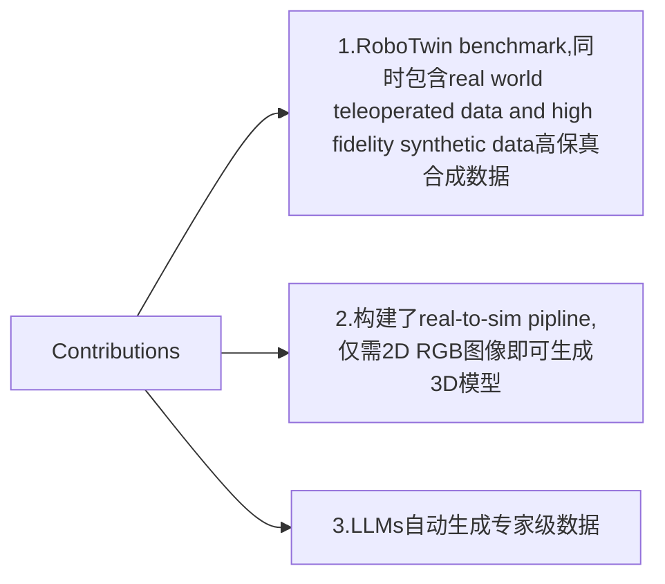
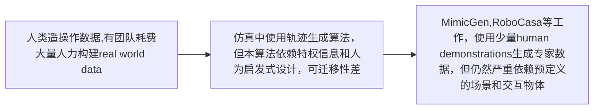

# Robotwin:Dual-Arm Robot Benchmark with Generative Digital Twins(early version)

## Abstract

双臂机器人的协同操作能力和工具使用能力由于专业训练数据的稀缺而发展受阻，因此文章提出RoboTwin这一benchmark,通过"真实世界遥操作数据+数字孪生合成数据"的方式解决上述问题。摘要中还言简意赅给出了RoboTwin的三大主要贡献：

1. 提出RoboTwin benchmark
2. 高效的现实到仿真数据转换的pipline(单张2D图生成3D模型)
3. LLMs驱动的自动专家级数据生成方法

## Introduction

研究的实际意义：聚焦dual-arm coordination(双臂协作任务，可以完成单臂无法完成的一些功能) + advanced tool use(工具的功能性应用)

AIGC的应用：避免使用昂贵的高保真传感器做digital twins,而是可以用2D RGB图像直接生成3D模型

创新性的流程：利用LLMs自动生成专家级训练数据

Introduction最后给出本文的contributions:

## Related Work

### Datasets and Benchmarks for Robotics

首先列举一些早期工作的方法:

因此文章提出了RoboTwin

### Robot Manipulation Learning Methods

这段主要说明机器人操作学习领域常采用"human demonstration instruct robots"的方式：

1. Behavior Cloning(BC):行为克隆，Robocasa正是采用了本方法
2. Offline Reinforcement Learning:离线强化学习，奖励函数难设计
3. Action Chunking with Transformers：基于Transformer的动作分块技术
4. Diffusion Policy:扩散框架，有效减少了ACT中存在的轨迹生成累积误差的情况。进一步又有3D Diffusion Policy,可使用点云

## Real-to-sim transfer of the scene

### Generative Digital Twin System

抛出核心问题：合成高保真仿真数据的关键是做出**accurate**且**cost-effective**的**digital twins**.

传统方法是用真实传感器，成本过高，文章提出使用**AIGC**(Artificial Intelligence Generated Content)将2D RGB图像转换成3D model

首先是将2D image转换成包含如下详细的3D model:geometry(几何结构),surface normals(表面法向量),wireframes(线框),texture(纹理)等。有了3D模型之后，需要给物体的功能部件分配特定坐标轴，这里来重点说明一下三大坐标轴，以原文中图片示例为例：

1. **Functional part and Functional Axis(功能部件与功能轴)**
   什么是功能部件？就是物体实现核心任务的关键部分，例如图中锤子的“锤头”，螺丝刀的“刀头”。而Functional Axis则是与功能部件对齐的坐标轴
2. **Approach Direction Axis**
   称为接近方向轴，即机械臂从“初始位置”到“抓取功能部件”的预设路径方向轴
3. **Point for Function and Contact**
    两大关键点位：Point for Function即工具作用于目标的核心点位，Point for Contact即抓取接触点位

这样做的实际意义就是让系统更好地区分功能部件和非功能部件，得到更好的抓取位姿。

有了上述内容后，利用GPT做下面两件事：

1. 分析任务需求生成符合需求的位姿序列
2. 基于计算出的位姿调用轨迹规划工具

## Benchmark

介绍了本文所提出的Benchmark,专为评估多场景下的**双臂机器人性能**而设计，由一系列tasks构成。

1. 针对每项任务，提供了一个功能完善的 API，支持在 “无限可变场景”（如物体摆放位置不同、环境条件变化）下生成专家级数据。
2. 每项任务均配备离线数据集，提供预生成的专家级数据，以支持机器人算法的离线训练与性能基准测试

## Real-world Dataset

1. 主要讲现实数据采集的硬件构造方法
2. 讲了数据集任务设计的两大核心亮点：
   1. 聚焦人机交互场景
   2. 聚焦工具使用场景
 17 项任务，其中 9 项任务以工具使用为核心，5 项任务涉及人机交互，6 项任务需双臂协同完成。每项任务均采集 30 条操作轨迹。

## Experiment
首先强调并非针对不同policy,只是研究benchmark中的专家级数据准确性与有效性。

采用3D Diffusion(DP3)对benchmark中的六项任务进行测试，每项任务分别用10,20,50组专家数据，实验结果发现50组相比于10组各任务成功率均有重大提升

